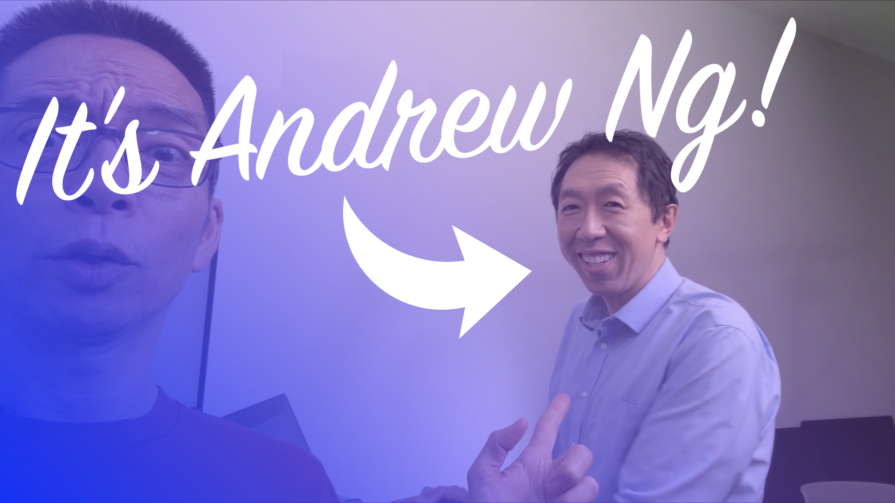

# pizzashop-and-ai

Please star the [official Semantic Kernel repo](https://github.com/microsoft/semantic-kernel) if you love [Sam Schillace](https://devblogs.microsoft.com/semantic-kernel/early-lessons-from-gpt-4-the-schillace-laws/)'s GPT4-infused approach to democratize AI productivity gains being led and built right now by the Jan, Jane, and Joe app developers out there. So much is changing right now that having an enterprise-first approach to creating with LLMs that is decidedly "boring" 🤓 feels like a good thing. And if you want to run the cooler things we have in Semantic Kernel give our recently refreshed [Chat Copilot](https://github.com/microsoft/chat-copilot) (w/ PLUGINS & PLANNERS & PERSONAS!) a test drive.

NEW course on DeepLearning.ai with Andrew NG is now available [link](https://www.linkedin.com/posts/andrewyng_how-can-business-leaders-not-just-coders-activity-7102673627975749633-k7Bt?utm_source=share&utm_medium=member_desktop)

This little repo plays off of Andrew Ng's [TED talk](https://www.ted.com/talks/andrew_ng_how_ai_could_empower_any_business) on the business value of AI and the example he gave of helping a pizza shop become more successful with AI. This is a set of six notebooks for AI aficionados in Semantic Kernel to build on Ng's vision of the future where AI is accessible to everyone. Enjoy!
